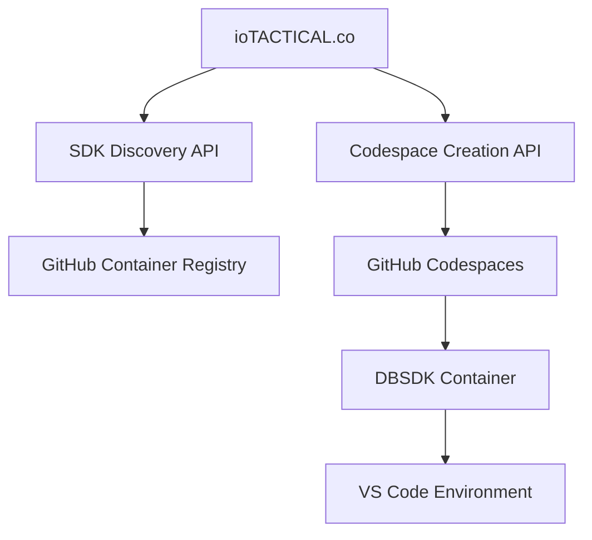

# ioTACTICAL.co Codespace Integration Plan

> **Objective**: Seamless integration between defense-builders-sdk containers and ioTACTICAL.co's Codespace launch workflow

## 🎯 Integration Overview

### User Experience Flow
1. **User visits ioTACTICAL.co**
2. **Selects "Launch ATAK Environment"** 
3. **Chooses SDK version** from available options
4. **Inputs project details** (name, description, template)
5. **Clicks "Create Environment"** 
6. **Codespace launches** with selected DBSDK container
7. **User immediately begins** ATAK plugin development

### Technical Architecture


## 🔧 Technical Integration Points

### 1. SDK Discovery API

**Endpoint**: `https://api.github.com/orgs/iotactical/packages/container/dbsdk-atak-civ/versions`

**ioTACTICAL.co Integration**:
```typescript
// Fetch available SDK versions
async function getAvailableSDKVersions() {
  const response = await fetch('/api/sdk/versions');
  return await response.json();
  // Returns: [{ version: "5.5.0.5", status: "active", features: [...] }]
}
```

**Alternatively, use our VERSION_MATRIX.md as JSON**:
```typescript
async function getSDKMatrix() {
  const response = await fetch('https://raw.githubusercontent.com/iotactical/defense-builders-sdk/main/VERSION_MATRIX.json');
  return await response.json();
}
```

### 2. Codespace Configuration Generation

**Dynamic devcontainer.json generation**:
```typescript
function generateDevcontainer(sdkVersion: string, projectName: string) {
  return {
    "name": `ATAK Plugin: ${projectName}`,
    "image": `ghcr.io/iotactical/dbsdk-atak-civ:${sdkVersion}`,
    "workspaceFolder": "/workspaces",
    "forwardPorts": [8080],
    "customizations": {
      "vscode": {
        "extensions": [
          "vscjava.vscode-java-pack",
          "redhat.vscode-android"
        ]
      }
    },
    "postCreateCommand": "chmod +x .devcontainer/post-create.sh && .devcontainer/post-create.sh",
    "remoteEnv": {
      "PROJECT_NAME": projectName,
      "ATAK_SDK_VERSION": sdkVersion
    }
  }
}
```

### 3. GitHub Repository Creation

**ioTACTICAL.co Backend Integration**:
```typescript
async function createATAKProject(params: {
  projectName: string;
  sdkVersion: string;
  template: 'basic' | 'advanced' | 'custom';
  description?: string;
}) {
  // 1. Create GitHub repository
  const repo = await octokit.repos.create({
    name: params.projectName,
    description: `ATAK Plugin: ${params.description}`,
    private: true, // or based on user preference
  });

  // 2. Initialize with template
  await initializeATAKTemplate(repo, params);
  
  // 3. Create devcontainer configuration
  const devcontainer = generateDevcontainer(params.sdkVersion, params.projectName);
  await octokit.repos.createOrUpdateFileContents({
    owner: repo.owner.login,
    repo: repo.name,
    path: '.devcontainer/devcontainer.json',
    message: 'Initialize DBSDK development environment',
    content: Buffer.from(JSON.stringify(devcontainer, null, 2)).toString('base64'),
  });

  // 4. Launch Codespace
  return await launchCodespace(repo, params.sdkVersion);
}
```

## 📋 Implementation Phases

### Phase 1: Registry Integration ✅
- [x] Fix container OS/arch metadata (linux/amd64)
- [x] Ensure container labels and metadata
- [x] VERSION_MATRIX.md for discovery
- [x] Container registry documentation

### Phase 2: API Development 🔄 
- [ ] Create SDK discovery endpoint
- [ ] VERSION_MATRIX.json generation
- [ ] Container validation API
- [ ] Health check endpoints

### Phase 3: Template System 📋
- [ ] ATAK plugin templates (basic, advanced, custom)
- [ ] Dynamic devcontainer generation
- [ ] Post-create scripts for project initialization
- [ ] Environment variable configuration

### Phase 4: Integration Testing 🧪
- [ ] End-to-end Codespace launch testing
- [ ] Container startup performance optimization
- [ ] User experience validation
- [ ] Error handling and recovery

### Phase 5: Production Deployment 🚀
- [ ] Monitor container registry performance
- [ ] Implement usage analytics
- [ ] Scale infrastructure as needed
- [ ] Documentation and user onboarding

## 🛠️ Required Components

### 1. ioTACTICAL.co Frontend Changes

**SDK Version Selector**:
```tsx
function SDKVersionSelector({ onVersionSelect }: { onVersionSelect: (version: string) => void }) {
  const [versions, setVersions] = useState([]);
  
  useEffect(() => {
    fetch('/api/atak-sdk/versions')
      .then(res => res.json())
      .then(setVersions);
  }, []);
  
  return (
    <Select placeholder="Choose ATAK SDK Version">
      {versions.map(v => (
        <Option key={v.version} value={v.version}>
          v{v.version} - {v.features}
        </Option>
      ))}
    </Select>
  );
}
```

**Project Configuration Form**:
```tsx
function ATAKProjectForm() {
  return (
    <Form onFinish={createATAKProject}>
      <Form.Item name="projectName" required>
        <Input placeholder="My ATAK Plugin" />
      </Form.Item>
      
      <Form.Item name="sdkVersion" required>
        <SDKVersionSelector />
      </Form.Item>
      
      <Form.Item name="template">
        <Radio.Group>
          <Radio value="basic">Basic Plugin Template</Radio>
          <Radio value="advanced">Advanced Plugin Template</Radio>
          <Radio value="custom">Custom Setup</Radio>
        </Radio.Group>
      </Form.Item>
      
      <Button type="primary" htmlType="submit">
        Launch Development Environment
      </Button>
    </Form>
  );
}
```

### 2. Backend API Endpoints

```typescript
// GET /api/atak-sdk/versions
export async function getATAKSDKVersions() {
  const versions = await fetchGitHubContainerVersions('iotactical/dbsdk-atak-civ');
  return versions.filter(v => v.status === 'active');
}

// POST /api/codespace/create
export async function createATAKCodespace(params: CreateCodespaceParams) {
  const repo = await createGitHubRepository(params);
  const codespace = await github.codespaces.createForRepository({
    repository_id: repo.id,
    machine: 'standardLinux32gb', // 4-core, 8GB RAM minimum for ATAK
    devcontainer_path: '.devcontainer/devcontainer.json',
  });
  
  return {
    repository_url: repo.html_url,
    codespace_url: codespace.web_url,
    status: 'creating'
  };
}
```

### 3. Template Repository Structure

```
atak-plugin-templates/
├── basic/
│   ├── .devcontainer/
│   │   ├── devcontainer.json
│   │   └── post-create.sh
│   ├── app/
│   │   └── src/main/java/com/mycompany/
│   ├── build.gradle
│   ├── gradle.properties
│   ├── local.properties.template
│   └── README.md
├── advanced/
│   ├── .devcontainer/
│   ├── app/
│   ├── library/
│   ├── tests/
│   └── docs/
└── custom/
    └── wizard-config.json
```

### 4. Post-Creation Scripts

**`.devcontainer/post-create.sh`**:
```bash
#!/bin/bash
set -e

echo "🚀 Initializing ATAK Plugin Development Environment..."

# Set up project from template
if [ ! -f "build.gradle" ]; then
    echo "📦 Copying ATAK plugin template..."
    cp -r /opt/atak-civ/${ATAK_SDK_VERSION}/PluginTemplate/* .
    
    # Customize project name
    sed -i "s/PluginTemplate/${PROJECT_NAME}/g" settings.gradle
    sed -i "s/PluginTemplate/${PROJECT_NAME}/g" app/src/main/AndroidManifest.xml
fi

# Configure local.properties
if [ ! -f "local.properties" ]; then
    echo "⚙️  Configuring Android SDK paths..."
    cat > local.properties << EOF
sdk.dir=/opt/android-sdk
takrepo.url=https://artifacts.tak.gov/artifactory/maven
takdev.plugin=.
EOF
fi

# Make gradlew executable
chmod +x gradlew

# Initial build to verify setup
echo "🔨 Running initial build to verify setup..."
./gradlew --version

echo "✅ ATAK Plugin Development Environment Ready!"
echo "📖 Next steps:"
echo "   1. Review the plugin template in app/src/main/"
echo "   2. Run './gradlew civDebug' to build your plugin"
echo "   3. Deploy to device with 'adb install app/build/outputs/atak-apks/sdk/*.apk'"
echo ""
echo "🔗 Useful commands:"
echo "   - ./gradlew tasks - See all available tasks"
echo "   - ./gradlew civDebug - Build debug version"
echo "   - ./gradlew connectedCivDebugAndroidTest - Run tests"
```

## 🔒 Security Considerations

### Container Security
- All containers run with restricted user permissions
- No root access required for ATAK development
- Network access limited to necessary endpoints
- Regular security scanning and updates

### Data Privacy
- No user code or data leaves the Codespace environment
- All development happens in isolated containers
- Optional telemetry for usage analytics (opt-in)

### Access Control
- GitHub authentication required for Codespace access
- Repository permissions managed via GitHub
- Container registry access through standard GitHub packages

## 📊 Monitoring & Analytics

### Key Metrics
- **Launch Success Rate**: Percentage of successful Codespace launches
- **Time to Ready**: How long from launch to development-ready environment
- **User Engagement**: Active development sessions, build frequency
- **Container Performance**: Resource usage, startup time

### Implementation
```typescript
// Track Codespace launches
analytics.track('codespace_launched', {
  sdk_version: params.sdkVersion,
  template_type: params.template,
  launch_time: Date.now(),
});

// Monitor container health
healthCheck.register('container_ready', async () => {
  return await checkATAKEnvironmentHealth();
});
```

## 🚀 Next Steps

### Immediate Actions
1. **Commit registry metadata fix** and trigger new container builds
2. **Create SDK discovery API** endpoint for ioTACTICAL.co
3. **Develop template repository** with basic/advanced/custom options
4. **Integrate with ioTACTICAL.co frontend** for SDK version selection

### Testing & Validation
1. **End-to-end testing** of complete user flow
2. **Performance optimization** for container startup time
3. **User experience validation** with beta testers
4. **Load testing** for concurrent Codespace launches

### Production Readiness
1. **Monitor container registry** performance and reliability
2. **Implement telemetry** for usage analytics and improvement
3. **Scale infrastructure** based on usage patterns
4. **Document troubleshooting** and support processes

---

**This integration will enable the seamless workflow**: `ioTACTICAL.co → SDK Selection → Instant ATAK Development Environment` 🎯