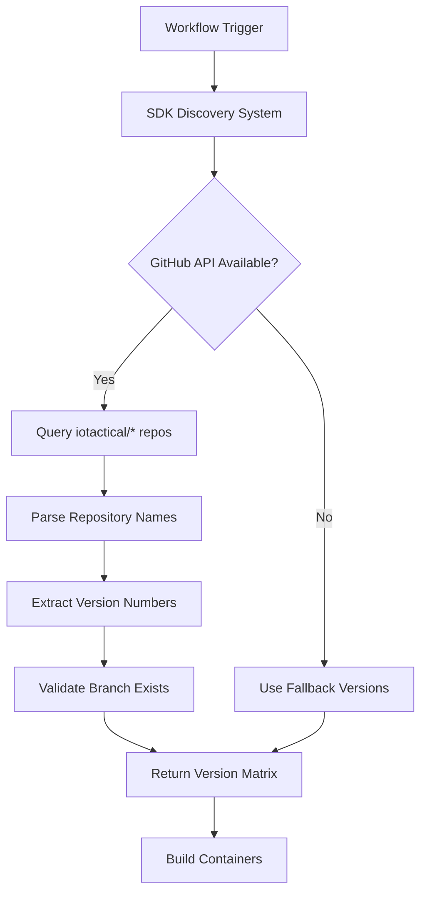

# DBSDK Version Discovery & Management Guide

## Overview

The Defense Builders SDK (DBSDK) uses a scalable, GitHub API-based version discovery system that automatically detects available SDK versions across multiple defense SDK types. This guide explains how the system works and how to extend it for new SDKs.

## 🏗️ Architecture

### Repository & Branch Pattern

The DBSDK follows a consistent naming convention across all defense SDKs:

```
Repository Pattern: {SDK-TYPE}-{VERSION}-SDK
Branch Pattern:     {sdk-type}-{version}

Examples:
├── ATAK-CIV-5.3.0.12-SDK    → atak-civ-5.3.0.12 branch
├── ATAK-CIV-5.4.0.21-SDK    → atak-civ-5.4.0.21 branch  
├── ATAK-CIV-5.5.0.5-SDK     → atak-civ-5.5.0.5 branch
├── WinTAK-5.2.1.4-SDK       → wintak-5.2.1.4 branch
├── TAK-Server-4.8.1.2-SDK   → tak-server-4.8.1.2 branch
└── ATAK-Forwarder-2.1.0-SDK → atak-forwarder-2.1.0 branch
```

### Discovery Flow



## 🔧 Components

### 1. Discovery Library (`lib/sdk-discovery.sh`)

Core library providing SDK version discovery functionality:

```bash
# Discover versions for a specific SDK type
discover_sdk_versions "atak-civ"

# Get detailed metadata
discover_sdk_versions_full "atak-civ" "true" "true"

# Discover all SDK types
discover_all_sdk_versions "true"
```

### 2. CLI Tool (`scripts/sdk-discovery`)

Command-line interface for testing and manual discovery:

```bash
# List supported SDK types
./scripts/sdk-discovery list-sdk-types

# Discover ATAK-CIV versions
./scripts/sdk-discovery discover atak-civ

# Get metadata with repository details
./scripts/sdk-discovery metadata atak-civ --format json

# Validate version format
./scripts/sdk-discovery validate atak-civ 5.5.0.5
```

### 3. Workflow Integration (`scripts/workflow-discover-versions.sh`)

GitHub Actions compatible script with fallback support:

```bash
# Basic discovery with fallback
./scripts/workflow-discover-versions.sh discover atak-civ "" '["5.5.0.5"]'

# Multi-SDK discovery
./scripts/workflow-discover-versions.sh multi atak-civ wintak tak-server

# Validate discovered versions
./scripts/workflow-discover-versions.sh validate atak-civ '["5.5.0.5"]'
```

## 📋 Supported SDK Types

| SDK Type | Repository Pattern | Version Pattern | Description |
|----------|-------------------|-----------------|-------------|
| `atak-civ` | `ATAK-CIV-*-SDK` | `X.Y.Z.W` | Android Tactical Assault Kit (Civil) |
| `wintak` | `WinTAK-*-SDK` | `X.Y.Z.W` | Windows Tactical Assault Kit |
| `tak-server` | `TAK-Server-*-SDK` | `X.Y.Z` | TAK Server SDK |
| `atak-forwarder` | `ATAK-Forwarder-*-SDK` | `X.Y.Z` | ATAK Forwarder SDK |

## 🚀 Usage Examples

### In GitHub Actions Workflow

```yaml
jobs:
  discover-versions:
    runs-on: ubuntu-latest
    outputs:
      versions: ${{ steps.discovery.outputs.versions }}
    steps:
    - uses: actions/checkout@v4
    
    - name: Discover SDK versions
      id: discovery
      env:
        GITHUB_TOKEN: ${{ secrets.GITHUB_TOKEN }}
      run: |
        ./scripts/workflow-discover-versions.sh discover \
          "atak-civ" \
          "${{ github.event.inputs.version }}" \
          '["5.3.0.12","5.4.0.21","5.5.0.5"]'
```

### Multi-SDK Discovery

```yaml
    - name: Discover all SDK versions
      env:
        GITHUB_TOKEN: ${{ secrets.GITHUB_TOKEN }}
      run: |
        ./scripts/workflow-discover-versions.sh multi atak-civ wintak tak-server
```

### Local Testing

```bash
# Test discovery system
export GITHUB_TOKEN="your_token_here"

# Discover ATAK-CIV versions
./scripts/sdk-discovery discover atak-civ

# Get detailed information
./scripts/sdk-discovery metadata atak-civ --format table

# Test workflow script
./scripts/workflow-discover-versions.sh discover atak-civ
```

## ➕ Adding New SDK Types

### 1. Update Discovery Configuration

Edit `lib/sdk-discovery.sh` to add your SDK type:

```bash
declare -A SDK_PATTERNS=(
    ["atak-civ"]="ATAK-CIV-*-SDK"
    ["wintak"]="WinTAK-*-SDK"
    ["tak-server"]="TAK-Server-*-SDK"
    ["your-new-sdk"]="YourSDK-*-SDK"    # Add your pattern
)

declare -A SDK_VERSION_PATTERNS=(
    ["atak-civ"]="[0-9]+\.[0-9]+\.[0-9]+\.[0-9]+"
    ["wintak"]="[0-9]+\.[0-9]+\.[0-9]+\.[0-9]+"
    ["tak-server"]="[0-9]+\.[0-9]+\.[0-9]+"
    ["your-new-sdk"]="[0-9]+\.[0-9]+"   # Add your version pattern
)
```

### 2. Update Framework Configuration

Add your SDK configuration in `sdk-configs/your-new-sdk.conf`:

```bash
# Your New SDK Configuration
SDK_TYPE="your-new-sdk"
SDK_NAME="Your New SDK"
SDK_DESCRIPTION="Description of your SDK"

# Discovery Configuration
SDK_VERSION_DISCOVERY="discover_your_new_sdk_versions"
SDK_VERSION_PATTERN="^[0-9]+\.[0-9]+$"
SDK_VERSION_SOURCE="filesystem"
```

### 3. Create Workflow

Create a new workflow file for your SDK type:

```yaml
name: Build Your New SDK

on:
  push:
    paths: ['sdks/your-new-sdk/**']
  workflow_dispatch:

jobs:
  discover-versions:
    runs-on: ubuntu-latest
    outputs:
      versions: ${{ steps.discovery.outputs.versions }}
    steps:
    - uses: actions/checkout@v4
    - name: Discover versions
      id: discovery
      env:
        GITHUB_TOKEN: ${{ secrets.GITHUB_TOKEN }}
      run: |
        ./scripts/workflow-discover-versions.sh discover \
          "your-new-sdk" \
          "${{ github.event.inputs.version }}" \
          '["1.0.0"]'
```

### 4. Test Your Addition

```bash
# Validate your SDK type
./scripts/sdk-discovery list-sdk-types

# Test discovery
./scripts/sdk-discovery discover your-new-sdk

# Validate a version format
./scripts/sdk-discovery validate your-new-sdk 1.0.0
```

## 🔒 Security & Rate Limits

### GitHub Token Requirements

- **Unauthenticated**: 60 requests/hour (sufficient for small-scale testing)
- **Authenticated**: 5,000 requests/hour (recommended for production)

```bash
# Set GitHub token for higher rate limits
export GITHUB_TOKEN="ghp_your_token_here"
```

### Caching

The discovery system includes built-in caching (TTL: 5 minutes by default):

```bash
# Control cache behavior
export DISCOVERY_CACHE_TTL=300  # 5 minutes

# Force cache refresh
./scripts/sdk-discovery discover atak-civ --no-cache
```

## 🎯 MVP Implementation Strategy

For immediate deployment, the system includes fallback mechanisms:

1. **Primary**: GitHub API discovery
2. **Fallback**: Hardcoded known versions
3. **Error Handling**: Graceful degradation

This ensures the CI/CD pipeline works even if:
- GitHub API is unavailable
- No repositories exist yet
- Rate limits are exceeded

## 📈 Scaling Considerations

### Performance

- **Parallel Discovery**: Multiple SDK types can be discovered concurrently
- **Efficient API Usage**: Minimal API calls with smart pagination
- **Caching Strategy**: Reduces redundant API requests

### Extensibility

- **Plugin Architecture**: Easy to add new SDK types
- **Flexible Patterns**: Supports various naming and versioning schemes
- **Multi-Organization**: Can be extended to scan multiple GitHub orgs

### Maintenance

- **Automated Discovery**: No manual version list maintenance
- **Self-Healing**: Automatically picks up new SDK releases
- **Monitoring**: Built-in logging and error reporting

## 🔧 Troubleshooting

### Common Issues

1. **No Versions Found**
   ```bash
   # Check if repositories exist
   ./scripts/sdk-discovery repos atak-civ
   
   # Validate patterns
   ./scripts/sdk-discovery list-sdk-types
   ```

2. **Rate Limit Exceeded**
   ```bash
   # Set GitHub token
   export GITHUB_TOKEN="your_token"
   
   # Use caching
   ./scripts/sdk-discovery discover atak-civ
   ```

3. **Invalid Version Format**
   ```bash
   # Validate version
   ./scripts/sdk-discovery validate atak-civ 5.5.0.5
   ```

### Debug Mode

```bash
# Enable debug logging
export DBSDK_DEBUG=true
./scripts/sdk-discovery discover atak-civ
```

## 📚 API Reference

### Discovery Library Functions

```bash
# Core discovery functions
discover_sdk_versions "sdk_type"
discover_sdk_versions_full "sdk_type" "validate_branches" "include_metadata"
discover_all_sdk_versions "include_metadata"

# Validation functions
validate_sdk_type "sdk_type"
validate_version_format "sdk_type" "version"

# Repository functions
discover_sdk_repositories "sdk_type"
check_version_branch "sdk_type" "repo_name" "version"
get_repository_metadata "repo_name"
```

### Environment Variables

```bash
GITHUB_TOKEN           # GitHub API token (recommended)
GITHUB_ORG             # GitHub organization (default: iotactical)  
DISCOVERY_CACHE_TTL    # Cache TTL in seconds (default: 300)
DBSDK_DEBUG           # Enable debug logging (true/false)
```

---

## 🎉 Summary

The DBSDK version discovery system provides:

✅ **Automated Discovery**: No manual version maintenance  
✅ **Scalable Architecture**: Easy to add new SDK types  
✅ **Robust Fallbacks**: Works even when GitHub API is unavailable  
✅ **CI/CD Integration**: GitHub Actions ready with proper error handling  
✅ **Multi-SDK Support**: Can discover versions across different defense SDKs  
✅ **Security Aware**: Proper token handling and rate limit management  

This system forms the foundation for scalable, maintainable defense SDK version management across the entire ioTACTICAL ecosystem.